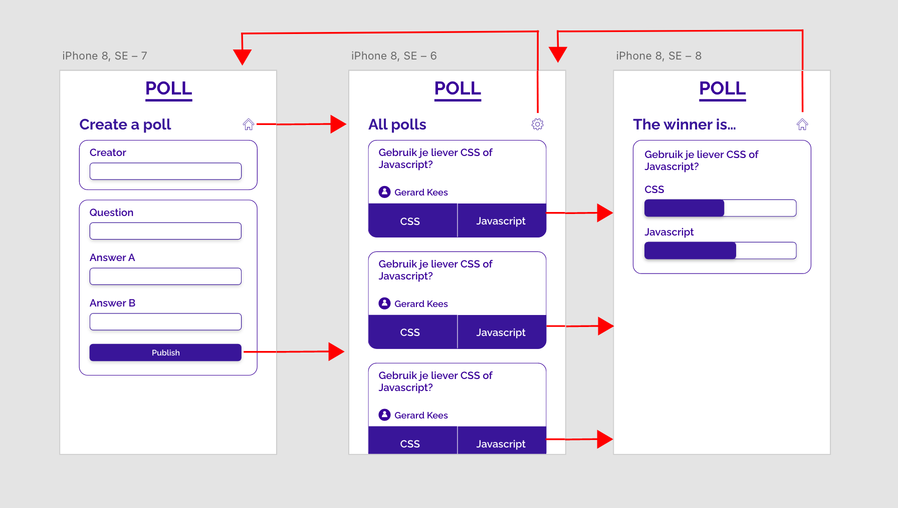

# Poll

For the last assignment I had the opportunity to choose between a few cases. I chose for creating a poll. It is kind of a cool concept that people can create a poll and others can answer them. I need to work with saving data to a specific file which I have never done before, so it seems like a fun experiment! In this readme you will find my most important insights and explanations about specific parts of my work.


## Table of Contents
- [Demo](#demo-only-local)
- [User Story](#user-story)
- [Demo](#wireflow)
- [Core Functionality](#core-functionality)
- [Progressive Enhancement](#progressive-enhancement)
- [Feature Detection](#feature-detection)


## Demo (only local)
*Only available on friday april 7th 2022*


## User Story
> I want to be able to present a poll to students with questions and answers during a lecture, and show the results immediately.


## Wireflow



## Core Functionality
In the wireflow above you can see the most important functionalities of the website. 
**There are three functions that fulfill the purpose of a poll:**
- Creating a poll
- Answering a poll
- See the results of a poll

It doesn't matter if javascript or css is disabled. These functions should always work on the website no matter what. If these functions work you got yourself a beautiful poll website right? Well... yes, but wouldn't it be way more beautiful if the website looks cooler and has some cool extra features? Of course it would, so keep on reading!

<p float="center">
  
   
  
</p>


## Progressive Enhancement

### What is Progressive Enhancement?
Once you have achieved the core functionality of your website, you can please the users using browsers with additional browser features by giving them extra features and styling that older or less advanced broswers don't have. It is a luxury really... but don't we love luxery!

### Progressive Enhancement for poll

#### Styling
The user story is for the teacher and the students. Students are mostly younger. A lot of young people like modern websites. This is the reason why kept my website as clean as possible, to give them a pleasant experience. I chose the color blue because it was the first color that came in mind when I thought about polls. I kept the styling pretty much the same as the styling in the [wireflow](#wireflow).


#### Scroll To Top
I made a simple button that makes sure the user can go back up to the top of the page after scrolling for a while. I used `scrollTo` to set the new scrollposition.

```
function scrollingTop() {
    scrollBtn.classList.add('to-top')
    window.scrollTo(0, 0);
    setTimeout(function() { scrollBtn.classList.remove('to-top') }, 2000);
}

scrollBtn.addEventListener('click', function() {
    scrollingTop();
});

window.addEventListener('scroll', () => {
    if(window.location.pathname === "/") {
        if (window.scrollY < 50) {
            scrollBtn.classList.remove('show');
        } else {
            scrollBtn.classList.add('show'); 
        }
    } 
});
```


#### Darkmode
For the users that don't like a light themed website, I also made a dark mode option. To make sure it stays dark on every page and also on reload, I used `localStorage` as a checker to see if the darkmode option has been selected before. Everytime the users comes to the website, the website will still be darkmode.

```
let localDarkMode = localStorage.getItem('Dark Mode');

if(localDarkMode === 'on') {
    document.body.classList.add('darkmode');
    darkmodeSVG.forEach(svg => svg.classList.toggle('hide'));
}

function darkMode() {
    darkmodeSVG.forEach(svg => svg.classList.toggle('hide'));
    document.body.classList.toggle('darkmode');
    if(localDarkMode === 'on') {
        localDarkMode = 'off';
    } else {
        localDarkMode = 'on';
    }
    console.log(localDarkMode)
    localStorage.setItem('Dark Mode', localDarkMode);
}

darkmodeBtn.addEventListener('click', darkMode);
```


## Feature Detection
Browsers have a lot of features, but not all browsers have the same features. The problem with that is that not every code you write is acceptable for every browser. Some browsers are less advanced than others.

There is a great website, [Can I Use?](https://caniuse.com/), that shows you what features ar supported on what browsers. During this project I used this site a **LOT** to check if I could use for example a specific selector, property, value, function, etc. So I programmed really carefully to make sure that most things that I use are actually supported on most browsers.

### CSS: Appearance
The CSS property `appearance` is quite well supported following the advise of [Can I Use?](https://caniuse.com/). The only problem I saw, was that on safari the appearance wasn't hidden using `appearance: none;`. On [Stack Overflow](https://stackoverflow.com/questions/47127201/webkit-appearance-none-not-working-for-button) someone had the same problem. Luckely there was a simple answer. I just had to add the `webkit` & `moz` versions as well to make sure it was supported on every device. It looks as following:
```
-webkit-appearance: none;
-moz-appearance: none;
appearance: none;
```

### HTML: Progress
Nowadays the HTML element `<progress>` is very well supported. The only problem is: it is a new element! So the first browser version of a lot of browsers does not support it. There actually are people still using that type of browser. There is no direct solution in HTML and CSS. I could also make a custom progress bar, but because of time instances I wasn't able to do so. 

**The HTML of the progressbar looks like this:**
```
<progress id="answerA" value="40" max="100"> 40% </progress>
```

**The CSS of the progressbar looks like this:**
```
progress: { 
    'styling'
}

progress::-webkit-progress-bar { 
    'styling'
}

progress::-webkit-progress-bar-value { 
    'styling'
}
```

Note that the progressbar itself is supported by [Firefox](https://www.mozilla.org/nl/firefox/new/) and Internet Explorer, but styling sadly isn't. It has a default styling that can't be changed. But on every other browser you can!


